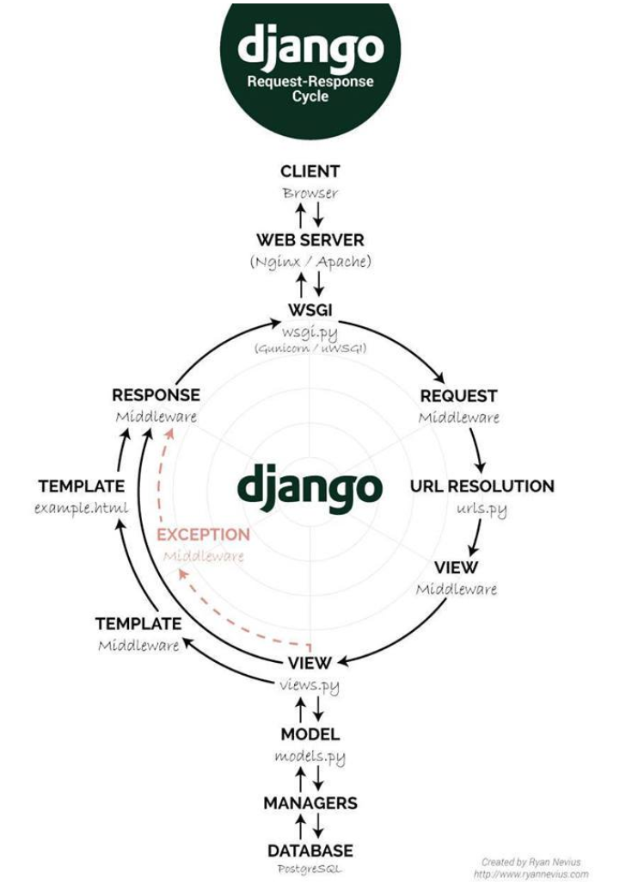

# CS Review

- [CS Review](#cs-review)
- [Security](#security)
  - [Rules](#rules)
- [Code](#code)
- [Internet](#internet)
  - [Web architecture](#web-architecture)
    - [DNS](#dns)
    - [Load balancer](#load-balancer)
    - [Web Application Servers](#web-application-servers)
    - [Caching Service](#caching-service)
    - [Job Queue](#job-queue)
    - [Full-text Search Service](#full-text-search-service)
    - [Services](#services)
    - [Data](#data)
  - [Networking](#networking)

# Security
## Rules
- Validate input from all untrusted sources - use whitelists not blacklists
- Keep it simple - complexity increases the likelihood of security holes
- Fail securely [owasp.org/index.php/Fail_securely](https://www.owasp.org/index.php/Fail_securely)
- Adhere to the principle of least privilege 
- Threat Risk Modeling [owasp.org/index.php/Threat_Risk_Modeling](https://www.owasp.org/index.php/Threat_Risk_Modeling)
- Don't write custom crypto
- What should every programmer know about security? [stackoverflow.com/questions/2794016/what-should-every-programmer-know-about-security](https://stackoverflow.com/questions/2794016/what-should-every-programmer-know-about-security)

# Code
- 
- 
- 
- 

# Internet
## Web architecture

### DNS
- provides a key/value lookup from a domain nam
### Load balancer
- horizontal scaling means that you scale by adding more machines into your pool of resources whereas *vertical* scaling means that you scale by adding more power (e.g., CPU, RAM)
- makes scaling horizontally possible
### Web Application Servers
- execute the core business logic that handles a user's request and sends back HTML to the user's browser
### Caching Service
- lookup information in close to O(1) time
### Job Queue
- a queue of *jobs* that need to be run and one or more job servers (often called *workers*) that run the jobs in the queue
### Full-text Search Service
- leverages an inverted index to quickly look up documents that contain the query keywords
### Services
- microservice examples: Account service, Payment service, HTML → PDF service
### Data
- The app sends data to the data *firehose* which provides a streaming interface to ingest and process the data. AWS Kinesis and Kafka are the two most common technologies for this purpose
- raw data as well as the final transformed/augmented data are saved to cloud storage (S3)
- transformed/augmented data is often loaded into a data warehouse for analysis (AWS Redshift)

## Networking

