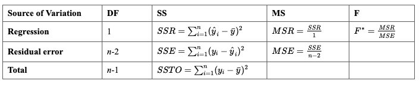

# ML Review

- [ML Review](#ml-review)
- [Algorithms](#algorithms)
- [Supervised Learning](#supervised-learning)
  - [Algorithm](#algorithm)
    - [Normal equation](#normal-equation)
    - [Regularization](#regularization)
    - [Overfit](#overfit)
  - [Linear Regression](#linear-regression)
  - [Classification](#classification)
    - [SVM](#svm)
  - [Time series](#time-series)
- [Unsupervised Learning](#unsupervised-learning)
  - [K-means](#k-means)
  - [PCA](#pca)
  - [Anomaly Detection](#anomaly-detection)
- [Reinforcement Learning](#reinforcement-learning)
  - [Model-based](#model-based)
  - [Value-based](#value-based)
  - [Other](#other)
- [Preprocessing](#preprocessing)
  - [One time - prior to pipeline](#one-time---prior-to-pipeline)
    - [outliers](#outliers)
    - [missing values](#missing-values)
    - [duplicates](#duplicates)
    - [feature correlation](#feature-correlation)
    - [skew / class distribution](#skew--class-distribution)
  - [Pipeline](#pipeline)
    - [scaling](#scaling)
- [Courses](#courses)
  - [Machine Learning for Trading (CS 7641)](#machine-learning-for-trading-cs-7641)
  - [Machine Learning (CS 7641)](#machine-learning-cs-7641)
  - [Reinforcement Learning (CS 7642)](#reinforcement-learning-cs-7642)
  - [AI (CS 6601)](#ai-cs-6601)
  - [Data Visualization (CSE 6242)](#data-visualization-cse-6242)
  - [ML Crash Course Google](#ml-crash-course-google)
- [Articles](#articles)
    - [Data Science for Startups: Data Pipelines](#data-science-for-startups-data-pipelines)
    - [Estimating Probabilities with Bayesian Modeling in Python](#estimating-probabilities-with-bayesian-modeling-in-python)

# Algorithms
|Name|Pros|Cons|
|---|---|---|
| Random Forests | + Much easier to tune than Gradient Boosting Machine (two hyperparameters vs three   + Deals well with uneven datasets that have missing variables   + Rarely overfits | - Slow at prediction time so less appropriate for high-speed data processing |
| Gradient Boosting Machine | + Can handle huge datasets (Millions x Millions)   + Classification and regression   + Lots of flexibility with the choice of loss functions: can be tailored to the characteristics of the problem | - Can be slow at training, since the trees are built sequentially   - Model is a black box (as for all ensemble methods)   - Prone to overfitting | 
| SVM | + Classification and regression   + Supports very high-dimensional and sparse data (hundreds of thousands of dimension)   + highly effective in text classification where high-scarcity and dimensionality are frequently observed in data   + High accuracy, good theoretical guarantees regarding overfitting   + Handles well outliers and noise   + Extremely fast at prediction time | - Cannot be parallelized, the whole dataset has to fit in memory   - Not good at handling very big dataset (more than a hundred of thousands of examples)   - Sometimes hard to tune due to a wide range of possible hyperparameter values |
| LSTM Neural Network | + LSTM units effectively solve the problem of vanishing gradient. They are typically used for sequential classification problems: text labeling, speech recognition   + Classifies relatively long (up to 40-50 tokens) sequences well   + Highly accurate even with a couple of hidden layers | - Very slow at training as cannot be parallelized between multiple GPUs   - Relatively slow at classification, since it classifies one token at a time (especially the Encoder-Decoder architecture)   - Black boxes without strong theoretical foundations |
| Convolutional Neural Network | + Very fast to train, can be parallelized between GPUs   + Learn low-level and high-level features so can be used as feature learners for other ML algorithms   + Very accurate at image classification and many other tasks, including language processing | - Require a lot of training data (however, such techniques as transfer learning can reduce the need for data)   - Sensible to parameter initialization and choice of hyperparameters   - Slow to train on CPU |
| KNN | + regression or classification. The predictions are given as the majority (classification) or the average (regression) of the labels in the close neighborhood of the input, unannotated example   + No assumptions about data :  works well for non-linearly separable data   + Simple to implement   + Flexible to feature/distance choices   + Naturally handles multi-class cases | - Search in a large space of examples to find nearest neighbors can be slow   - With a lot of training examples, the model can require a lot of memory   - Sensitive to irrelevant features and the scale of the data |
| K-Means | + Simple to use   + Fast   + Results are simple to understand | - Only works well when the shape of clusters are hyper-spherical or when clusters are far from one another   - Different runs of the algorithm will most probably yield in different clusterings of the same data   - Requires the number of clusters to be known in advance |
| EM | + Simplicity and ease of implementation   + Solutions to the M-steps often exist in the closed form   + Can often be easily parallelized and its memory requirements tend to be modest compared to other methods   + The algorithm is numerically very stable   + Soft-membership in clusters is often desirable   + Can be naturally used for finding outliers |  - Slow linear convergence   - Can converge to local optima   - As in K-Means, one needs to know the number of clusters   - One needs to carefully choose the generative model |
| Latent Dirichlet Allocation | + successfully applied to text analysis (topic modeling), social network analysis (community overlaps), content recommendation, genetic population analysis, and many others   + LDA takes a collection of documents, the number of topics, and returns a distribution of topics over documents and a distribution of words over topics   + Excellent empirical results   Mitigates overfitting well | - High computational complexity   - Nondeterministic (different runs can give different results)   - Doesn't work well on short documents. |

Sources:
- [semanti.ca/blog/?the-most-important-machine-learning-algorithms](https://semanti.ca/blog/?the-most-important-machine-learning-algorithms)

# Supervised Learning
## Algorithm
### Normal equation
- $Xw = y$
- $X^{T}Xw = X^{T}y$
- $(X^{T}X)^{-1}X^{T}Xw = (X^{T}X)^{-1}X^{T}y$
- $w = (X^{T}X)^{-1}X^{T}y$
- matrix inversion $O(n^3)$, where n=num of features
- n > 1000, better use gradient descent O(kn^2)
- (X_T*X) not invertible if feature are dependent or if n > num of examples
### Regularization
-  add to the cost function: $\lambda * w^2$
- add to the cost function: $1/m * \lambda * w$
- Normal equation regularized: $(X^T*X + \lambda * I)^{-1} * X^T * y = w$
- regularization term lambda*I fixes non-invertability in cases num examples < num features
### Overfit
- bias vs variances (underfit vs overfit) => plot degree polynomial vs error for train and test
- learning curves: training size vs cost
- High variance: large difference between cost_test and cost_training
- High bias: small difference between cost_test and cost_training, but both are large
- high variance (overfit) fixes: more training data, remove features, increase regularization lambda
- high bias (underfit) fixes: more features, polynomial features, decrease regularization lambda
- steps to examine a model: start with a simple algorithm, plot learning curves, examine samples where algo makes errors 
- More data helps if
  - a human expert can can accurately predict given current features
  - algorithm with many parameters

## Linear Regression

- Assumptions
  - LINE assumptions for confidence intervals: 
    - Linearity: each y is a linear combination of features
    - Independent errors
    - Normal errors
    - Equal error variances
    - (x must is within scope of the model)
  - if all tested is that the slope β1 is 0, you should be okay even if it appears that the normality condition is violated
  - if you want to use your model to predict a future response ynew, then you are likely to get inaccurate results if the error terms are not normally distributed
  - Tests
    - Plot predicted values y (x-axis) vs errors size (y-axis)
    - Plot each INCLUDED predictor (x-axis) vs errors size (y-axis)
    - Histogram of residuals (should be appx normal)
    - Scatter of residuals (x-axis) vs percent (log y-axis): should be appx straight
    - Plot each EXCLUDED predictor (x-axis) vs errors size (y-axis). Consider including if a useful trend appears
    - Anderson-Darling Test: area between a fitted line and a nonparametric step function
    - Shapiro-Wilk Test
    - Ryan-Joiner Test
    - Kolmogorov-Smirnov Test: compares the empirical cumulative distribution function of sample data with the distribution expected if the data were normal
- Variance
  - sample: $\frac{\sum(y_i - \bar{y})^2}{n-2}$
  - costs us 2 degrees of freedom to estimate b0 and b1: therefore, n-2
- $R^2$ 
  - quantifies the strength of a linear relationship, $R^2$ could be 0 but there could be a non-linear relationship
  - value should not be interpreted as meaning that the estimated regression line fits the data well (it might be slightly curved)
  - coefficient of determination $R^2$ could be greatly affected by just one data point
  - always increases (or stays the same) as more predictors are added to a multiple linear regression model, even if the predictors added are unrelated to the response variable
- Confidence interval
  - $\bar{y} +- t * sd$
  - $\beta +- t*(\frac{MSE}{\sum_i(y_i - \bar{y})})^{1/2} = t*(\frac{\sum_i(y_i - \hat{y})/n}{\sum_i(y_i - \bar{y})})^{1/2}$
- Analysis of Variance (ANOVA)
  - 
- [Hypothesis test](https://newonlinecourses.science.psu.edu/stat501/node/311/)
  - t* = (sample coefficient - hypothesized value) / standard error of coefficient.
  - testing if $b_1=0$
    - $t^* = (b_1 - 0) / SE(b_1)$
  - 
- [Model evaluation](https://newonlinecourses.science.psu.edu/stat501/node/295/)
  - Define a larger full model
  - Define a smaller reduced model. (one with fewer parameters.)
  - Use an F-statistic to decide whether or not to reject the smaller reduced model in favor of the larger full model. Low t-statistic > reject smaller model.
  - Test if model_reduced = model_full
  - $F^* = (SSE(R) - SSE(F))/(df_r - df_f) / (SSE(F) / df_f)$
    - df: degrees of freedom, number of observations n - number of parameters
  - If t > 0.05 => cannot reject null hypotheses
- [Categorical Predictors](https://newonlinecourses.science.psu.edu/stat501/node/301/)
  - When two predictors do not interact, we say that each predictor has an "additive effect"
  - Leaving out interacting terms may make the entire model insignificant
  - Piecewise model: introduce new variable for subset of data if function is piecewise: $y = b + w_1*x + w_2*(x-70)$
    - Allows for two lines to be fit: < 70 and > 70
- [Model building](https://onlinecourses.science.psu.edu/stat501/node/328/)
  - model is underspecified
    - biased regression coefficients and biased predictions of the response
  - model is overspecified: contains one or more extraneous variables (unrelated to features or target)
    - unbiased regression coefficients, unbiased predictions of the response, and an unbiased MSE BUT confidence intervals tend to be wider
    - should not be used to describe the effect of a predictor
    - If only the prediction of response is important: multicollinearity is less concerning
  - Stepwise Regression: entering and removing predictors
    - Specify an Alpha-to-Enter: eg 0.15, Specify an Alpha-to-Remove: e.g. 0.15
    - Add the most signification feature first
    - Next, add the second most significant test tge model including the most significant
      - If the first feature becomes not significant by including the most significant second feature, remove the first
    - Continue with the next feature
  - Best Subsets Regression
    - select the subset of features that best meet an objective, such as the largest R2 value or the smallest MSE
    - given n features, we have 2^n possible models
    - to cut down on the size to to explore, find few best with 1 feature, few best with 2 features, few best with 3 features ... and then compare
    - R2-adj makes adjustments for model size (no of features) so it's better for comparing across different models than raw R2
    - To select the best model from those suggested by the 2 procedures, check for multicolinearity. No none present, take the simpliest
  - Information Criteria
    - Bayesian Information Criterion (BIC): $n*ln(SSE) - n*ln(n) + p*ln(n)$
    - places a higher penalty on the number of parameters in the model so will tend to reward more parsimonious (smaller) models. lower BIC is better
- Influential points
  - Outliers: extreme y
  - High leverage points: extreme x
  - MSE is substantially inflated by the presence of the outlier
  - Handling data errors:
    - If the error is just a data entry or data collection error, correct it.
    - If the data point is not representative of the intended study population, delete it.
    - If the data point is a procedural error and invalidates the measurement, delete it.
  - Did you leave out any important predictors?
  - Should you consider adding some interaction terms?
  - Is there any nonlinearity that needs to be modeled?
- [Multicollinearity](https://onlinecourses.science.psu.edu/stat501/node/344/)
  - two or more of the predictors in a regression model are moderately or highly correlated
  - Structural multicollinearity is a mathematical artifact caused by creating new predictors from other predictors
  - Data-based multicollinearity is a result of reliance on purely observational data, or the inability to manipulate the system on which the data are collected
  - Perfectly uncorrelated coefficients
    - SE of regression, SE of features, coef of features are the same in case of multiple and single regression
  - Highly correlated features
    - the estimated coefficient of any one variable depends on which other predictor variables are included in the model
    - precision of the estimated regression coefficients decreases
    - does not prevent good, precise predictions
  - detecting multicollinearity using Variance Inflation Factors quantifies how much the variance is inflated
  - to remove structural correlation (x+x^2), we need to center the feature x
- $y = x_0 + w_1*x_1 + w_2(x_2)^{1/2}$ has asymptotic shape

## Classification
- sum of squres cost function if non-convex, so we need to use: $-y*log(h(x)) - (1-y)*log(1-h(x))$
  - based on MLE
- gradient descent alternatives: Conjugate gradient, BFGS, L-BFGS
- Precision: TP / (TP + FP)
- Recall: TP / (TP + FN)
- F1 score: 2*(precission * recall) / (precission + recall)
  - [source](https://towardsdatascience.com/beyond-accuracy-precision-and-recall-3da06bea9f6c)
### SVM
- similar cost function as logistic regression
  - Logistic: 
  - $-ylog(h(x)) - (1-y)log(1-h(x)) + 1/2 * \lambda * w^2$
  - SVM: 
  - $1/\lambda * (-ylog(cost(w, x)) - (1-y)log(1-cost(w, x))) + 1/2 * w^2$
- cost is similar to log(h(x)) except as straight line, 
  - SVM cost: y=1: w*X > 1, y=0: w*X < -1 => hence margin in between, works better in the case of overfitting
  - Logistic cost: y=1: w*X >= 0, y=0: w*X < 0
- Kernel: similarity function. Gaussian: $k(x_1, x_2) = log(-||x_1-x_2||^2/(2*\sigma^2))$
  - == 1 when points are close, == 0 when they are far away
- kernels are slow to use with logistic reg, but fast for SVM thanks to kernel tricks
- kernels: linear (aka no kernel)
- use feature scalling with kernels so all features are weighted the same
- many features & not many samples => use logistic
- medium features & samples => use SVM with Gaussian kernel
- few features & many samples => use logistic or SVM without a kernel (kernel is slow)
- [coursera.org/learn/machine-learning/lecture/sHfVT/optimization-objective](https://www.coursera.org/learn/machine-learning/lecture/sHfVT/optimization-objective)

## Time series
- Algorithm requirements:
  - extrapolate patterns outside of the domain of training data
  - derive confidence intervals
- Most common algos
Linear regression
  - +Handles different time series
  - +High interpretability
  - -Sensitive to outliers
  - -Narrow confidence intervals
  Exponential smoothing
  ARIMA (Autoregressive Integrated Moving Average)
  Dynamic Linear Model
- Sources
  - [datascience.com/blog/time-series-forecasting-machine-learning-differences](https://www.datascience.com/blog/time-series-forecasting-machine-learning-differences)

# Unsupervised Learning
## K-means
- random initialization: randomly pick k points are centroids
- choose the rights number of clusters: the elbow method

## PCA
1. find k vectors that minimize perpendicular distance to points
2. tranform original data using newly found vectors
- typically, use k such that 99% of variation is retained
- used mainly to speed up the running time of algorithms

## Anomaly Detection
- anomaly detection is useful when we have a very small number of positive classes (engine failures)
- future anomaly examples may look nothing like the past. This is the where supervised learning (SL) differs because SL assumes that future examples fall within the range of training data
- non-gaussian features transforms: log(x), log(x+c), x^1/2, x^1/3
- Normal curve : $\frac{1}{(2*\pi)^{1/2}*\sigma} * e^\frac{-(x-\mu)^2}{2*\sigma^2}$
- z-test is used for testing the mean of a population versus a standard, or comparing the means of two populations, with large (n ≥ 30) samples whether you know the population standard deviation or not
- t-test is used for testing the mean of one population against a standard or comparing the means of two populations if you do not know the populations’ standard deviation and when you have a limited sample (n < 30)
- Algorithm 
  1) choose features that indicate annomalous variables
  2) fit params mu, sigma for each feature assume each feature has normal distribution N
  3) compute probability $p(x) = \prod( N(x_j | \mu_j, \sigma_j) )$
  4) anomaly detected if p(x) < epsilon
  5) determine best epsilon by selecting the highest f1 score on CV
- Multivariate gaussian is used to model the features as one distribution instead of product(p(x1), p(x2)...)
  - individual distribution may not uncover anomaly if their individual values are reasonable but their combined distribution is extreme
  - previous model is a special case where no correlation between features exists
  - multivariate case allows for possible correlations
  - more expensive than the product of single Gaussians
  - single Gaussians can still be used when interactions variables are included
  - requires m > n; no examples > no features. In practice, m >> n

# Reinforcement Learning

## Model-based
- Learn model of the world, update and re-plan often
- Very data efficient, once model is learned
- E.g. Chess
## Value-based
- Learn state or state-action
- Exploration is necessary
- Q-Learning
  - $Q(S_t, A_t) = Q(S_t, A_t) + \alpha * [R_{t+1} + \gamma*\max_{a}Q(S_{t+1}, a) - Q(S_t, A_t)]$
  - Table: $Q(S_t, A_t)$
  - DQN: $Q(S_t, A_t, \Theta) \approx Q^*(S_t, A_t)$
- Policy-based
  - Learn stochastic policy function straight from the world
  - Network outputs the probability of taking a certain action given examples of actions taken in different states
## Other
- Solving the Multi-Armed Bandit Problem
  - Q_k = 1/k * (r_1 + r_2 + r_3 ... + r_k)
  - Q_k+1 = Q_k + 1/(k+1) * (r_k+1 - Q_k)
  - [towardsdatascience.com/solving-the-multi-armed-bandit-problem-b72de40db97c](https://towardsdatascience.com/solving-the-multi-armed-bandit-problem-b72de40db97c)

# Preprocessing
## One time - prior to pipeline
### outliers
### missing values
### duplicates
### feature correlation
### skew / class distribution
- Use higher precession if predicting 1 is risky
- Use recall precession if predicting 0 is risky (cancer)
- F1 score can be used as a tradeoff
## Pipeline
### scaling
- feature scaling may be useful to improve the speed of training (in gradient descent)
- constant gradient descent is slow for large values
- to verify the correctness of gradient descent: confirm that the cost functions decreases with iterations towards convergence
  - [coursera.org/learn/machine-learning](https://www.coursera.org/learn/machine-learning)

- collect more data
- use a difference metric: precision / recall / F1 score
- over or under sampling (copy infrequent classes, remove frequent)
- generate synthetic samples
- try different algorithms (decision trees often perform well on imbalanced datasets)
- different perspective (anomaly detection and change detection)
  - [machinelearningmastery.com/tactics-to-combat-imbalanced-classes-in-your-machine-learning-dataset/](https://machinelearningmastery.com/tactics-to-combat-imbalanced-classes-in-your-machine-learning-dataset/)
  
- If important predictor variables are omitted, see whether adding the omitted predictors improves the model.
  - [onlinecourses.science.psu.edu/stat501/node/318/](https://onlinecourses.science.psu.edu/stat501/node/318/)
- If the mean of the response is not a linear function of the predictors, try a different function. For example, polynomial regression
- If there are unequal error variances, try transforming the response and/or predictor variables or use weighted least squares regression.
  - each observation i is weighted by $1/\sigma_i^2$
- If an outlier exists, try using a "robust estimation procedure."
- If error terms are not independent, try fitting a "time series model."
- transforming the x values is appropriate when non-linearity is the only problem — the independence, normality and equal variance conditions are met
- if the error terms are well-behaved, transforming the y values could change them into badly-behaved error terms
- transforming the response y values should be considered when non-normality and/or unequal variances
- typically try ln transformation for non-linearity. Others e^-x, 1/x, ln(y), ln(y) + ln(x)
- transforming the y-variable changes the variance of the y-variable and the errors
- interaction terms (x1*x2): if $X_1*X_2$ is shown to be a statistically significant predictor of Y, then your model should also include the "main effects" $X_1$ and $X_2$

# Courses
## Machine Learning for Trading (CS 7641)
- example x’s: price, bollinger, momentum; y’s: return and future price
- Supervised regression learning: linear regression, KNN, trees, forests
- RL
  - Markov decision problem: set of states (in market), set of actions (buy, sell, nothing), transition function T(state, action, state), reward function R(state, action)
  - Q Learning: Q’[s,a] = (1-alpha) * Q[s,a] + alpha * improved_estimate
- Induction, deduction, supervised learning, unsupervised learning (news, genes), RL, decision trees
- Definitions: instances (input), concept (function), target concept (answer), hypothesis (set of all possible concepts), sample (training set), candidate (possible target concept), testing set. Tree nodes = attributes, edges = values
- Preprocessing (clean, train/test) -> Learning (model, cross-validate, performance, params optimization) -> Evaluation (against test) -> Prediction
- Target function: type of knowledge to be learned (e.g. each possible checkers board score)
- Representation for target function (e.g. linear function of board artifacts, # of pieces, # of pieces threatened)
- Learning mechanism: gradient descent
- Decision Tree: Robust to errors and missing attributes
- Entropy: sum(-p*logp)
- Overfit -> Occam's razor
- NN: Well suited for noisy, complex sensor data, such as inputs from cameras and microphones
- Gradient descent derivation
- Sigmoid: 1/(1-e^-y)
- Instance based learning (KNN): training data in storage and use it to make a forecast
- Other algorithms reduce data into a function, then make predictions ignoring the data
- Bayesian Learning: P(h | D) = P(D | h) * P(h) / P(D)
  $$ P(disease | pos) = 21\% = 98\%*0.8\% / (98\%*0.8\% + 3\%*99.2\%) $$
- Pros/cons: DT, KNN, Boosting, SVM, NN, Bayes, Random Opt/Annealing
- Review
  - Maximum a posteriori MAP = argmaxh P(D | h) * P(h)
  - Maximum likelihood ML = argmaxh P(D | h)
- EM: Will not diverge, may not converge, can get stuck - must random restart
- K-means: randomly select k centers (points), assign each point to cluster (E), recalculate centers (M)
- Feature selection: exponential problem 2^n
- Filtering: selecting features first, then running algo, ignores learning problem, fast. Can use decision tree to select which features give most info. gain, then pass those features to another learner such NN
- Wrapping (optimizing algorithm based on given features and reiterating, slower). forward search (run learner with each feature independently, keep the best, add one more feature in addition to first and iterate as long as error improves)
- Feature transformation: PCA (Maximizes variance, Mutually orthogonal), ICA (Cocktail party problem: extract voice from multiple sources in a party)

## Machine Learning (CS 7641)
- PCA: Obtain the Eigenvectors and Eigenvalues from the covariance matrix or correlation matrix. Sort eigenvalues in decreasing order
- Value Iteration, Policy Iteration, and Q-Learning
- Feature selection => curse of dimensionality (amount of data needed is 2^n, where n is the number of features)

## Reinforcement Learning (CS 7642)
- RL: model is unknown or difficult to work with directly
- states (S), actions (A), rewards (R)
- methods for solving finite Markov decision problems:  
  - dynamic programming: methods are well developed mathematically, but require a complete and accurate model of the environment
  - Monte Carlo methods: methods don't require a model and are conceptually simple, but are not well suited for step-by-step incremental computation
  - temporal-difference learning: methods require no model and are fully incremental, but are more complex to analyze. Monte Carlo methods must wait until the end of the episode to determine the increment, TD methods need wait only until the next time step
- Q-learning. ε-greedy guarantees convergence if 
$$ ∑\alpha =\infty ; ∑\alpha^2 < \infty $$
- Sarsa update
  $$ Q_t = Q_t + \alpha(r + \gamma Q(s_{t+1}, a_{t+1}) − Q(s_t, a_t)) $$
- partially observable Markov decision processes: the agent does not simply know its state and must take actions to gain state-related information
- Q-Learning (off-policy greedy)
- SARSA (on-policy)
- Deep Q Network
  
- Plans: fixed, conditional (if statements), stationary
policy/universal plan (mapping from state -> action, RL focus)
- Summarize policy
  - One sequence: sum of rewards
  - Over many sequences: average expectation
- Evaluate learner: total value, computational complexity (time),
sample complexity (time)
- Incremental learning
$$ V_T (S_1) = V_{T_−1}(S_1) + \alpha_T [R_T (S_1) − V_{T−1}(S_1)] $$
- Where
$$ α_T = 1 / T $$
- Must satisfy
$$ ∑\alpha =\infty ; ∑\alpha^2 < \infty $$
- Examples
$$ ∑\alpha = 1 / T $$
$$ ∑\alpha = (1 / T)^{2/3}  $$

TODO Next notes_2017.pdf p 157

## AI (CS 6601)
- AI (pass Turing test): natural language processing, knowledge representation, automated reasoning, machine learning (extrapolate), computer vision, robotics (manipulate objects)
- Minimax time: $O(b^m)$ where b is the number of actions and m number of steps (depth of the tree)
- Search: BFS, DFS, Cheapest first search (explored shortest total length), A*
- - Annealing: use temperature as a proxy for randomness. Start with high temperature (high randomness) and slowly lower it (low randomness)
- Travelling salesman: randomly connect cities, then remove any crossings of paths (within 1% of optimal)
- Genetic algorithms: determine score for each state. Higher scores have higher probability to appear in next generations. Crossover with other state for breed new, more optimal states
- Decision theory = probability theory + utility theory
- Bayes rule: P(cause | effect) = P(effect | cause)P(cause) / P(effect)
- ML: KNN, Gaussian, Naive Byers
  - DT: decide each variable to split on based on information gain. Info gain is the expected reduction in entropy
  - Boosting: use weak classifiers and combine then by weighting errors more
  - NN: perceptron and backprop
  - K-means: assigning to clusters and updating means of clusters correspond respectively to the E (expectation) and (maximization) steps of the EM algorithm. O(k*n) where k is the k means and n is number of data
- Learning from Examples
- Cross validation methodology: k-fold training set and test set
- Regularization: process of explicitly penalizing complex
hypotheses
- Hidden Markov Models

## Data Visualization (CSE 6242)
- 1D data: histogram, strip plot, box plot
- 2D data: scatter plot, line plot
- 3D+: multivariate scatter, facets, contour
- Strip plot: x-axis description, y-axis value
- Histograms: x-axis bar label, y-axis count
- Multivariable scatter: use point type to distinguish 3rd dimension
- Missing Completely At Random (MCAR): probability that data is missing does not depend on observed or unobserved measurements. All solutions possible
- Missing At Random (MAR): probability that data is missing does not depend on unobserved data. May introduce bias
- Solutions:
  - Remove entire row
  - Replace with most likely value
  - Imputation: Build a probability model and sample from the model
- Outliers detection:
  - Below and above certain percentile (robust)
  - More than x standard deviations (requires the computation of mean and median which is not robust given outliers)
- Solutions:
  - Truncate: remove all outliers
  - Winsorization: shrink to the border of the main part of data
  - Robust procedure: keep all data, choose robust procedure (such as median)
- Transformation: Highly skewed distribution -> transformation -> map data to common distribution (Gaussian or Gamma) -> fit model
- power transform: $\frac{x^\lambda-1}{\lambda}$
  - lambda > 1: convex, removes left skew
  - lambda < 1: concave, removes right skew
  - lambda choice: histogram or log-log plot
- Other transforms: binnning, binarization (0-1), tall vs wide data (easier to analyze, hard to remove)
- Logistic regression
- If data not linearly separable in original dim (eg 2D): increase dimension (x1, x2) => (1, x1, x2, x1^2, x2^2, x1x2)

## ML Crash Course Google
- Terminology: labels, features, examples, models
- A regression model predicts continuous values
- A classification model predicts discrete values
- Regression:
  - loss is a number indicating how bad the model's prediction was
  - Mean square error (MSE) is the average squared loss per example over the whole dataset
- Gradient descent, convergence, training, loss
- A Machine Learning model is trained by starting with an initial guess for the weights and bias and iteratively adjusting those guesses until learning the weights and bias with the lowest possible loss.
- gradient always points in the direction of steepest increase in the loss function
- gradient descent algorithm takes a step in the direction of the negative gradient
- Stochastic gradient descent (SGD) uses only a single example (a batch size of 1 per iteration
- TensorFlow: Tensors are N-dimensional (where N could be very large) data structures, most commonly scalars, vectors, or matrices
- Estimator (tf.estimator)         High-level, OOP API.
- tf.layers/tf.losses/tf.metrics         Libraries for common model components.
- TensorFlow         Lower-level APIs
- TensorFlow consists of the following two components:
  - a graph protocol buffer
  - a runtime that executes the (distributed) graph
- These two components are analogous to Python code and the Python interpreter

# Articles

### Data Science for Startups: Data Pipelines
- low latency
- scalability
- interactive querying
- versioning
- monitoring
- testing
- [towardsdatascience.com/data-science-for-startups-data-pipelines-786f6746a59a](https://towardsdatascience.com/data-science-for-startups-data-pipelines-786f6746a59a)

### Estimating Probabilities with Bayesian Modeling in Python
- Bayesian Model: (p | x, a). x are actual samples, a are prior beliefs
- parameter vector for a multinomial is drawn from a Dirichlet Distribution
  - (p | x, a) = (c_i + a_i) / (N + sum(a_i))
- [towardsdatascience.com/estimating-probabilities-with-bayesian-modeling-in-python-7144be007815](https://towardsdatascience.com/estimating-probabilities-with-bayesian-modeling-in-python-7144be007815)

