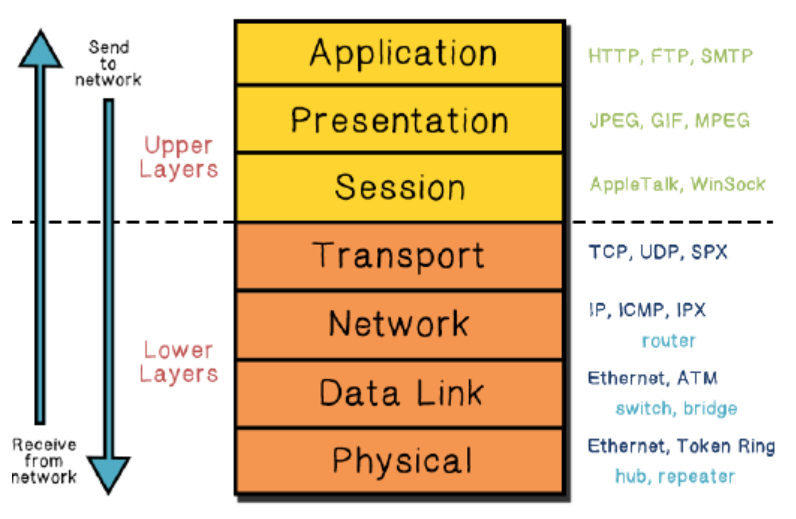
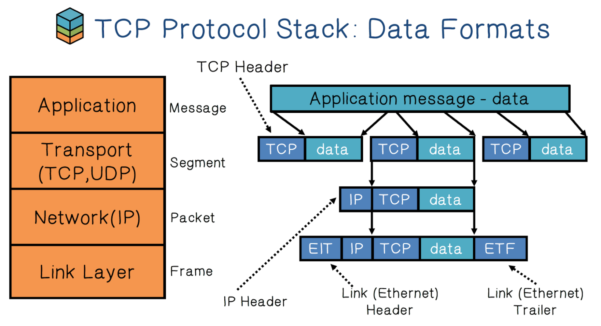

# CS Review

- [CS Review](#cs-review)
- [Security](#security)
- [Code](#code)
- [Internet](#internet)

# Security
- What should every programmer know about security? [stackoverflow.com/questions/2794016/what-should-every-programmer-know-about-security](https://stackoverflow.com/questions/2794016/what-should-every-programmer-know-about-security)
  - 

# Code
- 
- 
- 
- 

# Internet

